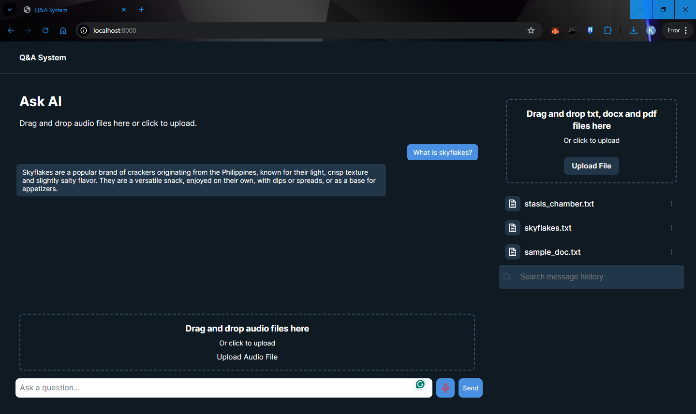

# 🧠 AI-Powered RAG Web App

This project is a **full-stack AI-powered Retrieval-Augmented Generation (RAG) application** that enables users to upload documents or audio files, ask natural language questions, and receive AI-generated answers based on the content.

It combines **FastAPI (Python backend)**, **HTML/CSS/JavaScript frontend**, **Faster-Whisper for transcription**, and **llama.cpp for embeddings + LLM inference**.

---

## 🚀 Features

- 📂 **Document Management**

  - Upload multiple documents (`PDF`, `TXT`, `DOCX`, etc.)
  - Rename and delete uploaded documents
    
    

- 🔍 **Ask Questions**

  - Type in questions directly
  - Context-aware Q\&A against selected/focused documents
    
    

- 🖼 **Drag & Drop**

  - Drag and drop files for instant upload
  - Drag and drop **audio files** (MP3 supported) for transcription + Q\&A
    
    

- 🎙 **Speech to Text**

  - Upload `.mp3` audio files for transcription
  - Uses **Faster-Whisper** for fast and accurate transcriptions
  - **Live recording transcription** is a planned future update (requires more compute)
    

- 💬 **Conversation Memory**

  - Message history preserved for context
  - Search through past Q\&A conversations
    
    

---

## ⚙️ How It Works

1. **Upload** documents or audio files.

   - Text-based documents are embedded using **llama.cpp embeddings**.
   - Audio files (`.mp3`) are transcribed into text using **Faster-Whisper**.

2. **Ask Questions** via text input or from focused documents.

   - The backend retrieves relevant document chunks (via embeddings).
   - The **llama.cpp LLM** generates a natural response based on context + query.

3. **Results** are displayed on the frontend with history saved for reference.

4. (Future update) **Live recording transcription** will capture audio in real-time, transcribe locally, and feed directly into the LLM pipeline.

---

## 🛠 Tech Stack & Skills Used

- **Frontend**

  - HTML, CSS, JavaScript
  - Drag-and-drop file handling
  - Dynamic UI updates

- **Backend**

  - **Python** (FastAPI for API endpoints)
  - Faster-Whisper (local speech-to-text)
  - llama.cpp (local embeddings + LLM inference)

- **AI / ML**

  - Retrieval-Augmented Generation (RAG)
  - Embedding-based document retrieval
  - Transcription with Faster-Whisper

- **Other Skills**

  - REST API development
  - Full-stack integration
  - Asynchronous request handling
  - User experience design (UI/UX flow)

---

## 📸 Screenshots

### Landing Page

### Drag & Drop File Upload

### Drag & Drop Audio Upload

### Typing Questions

### Focused Document Question

### Message History

### Message Search

### Recorded Audio Transcription

### Rename & Delete Documents

### Uploaded Documents

---

## 🔮 Future Plans

- Live local audio transcription (real-time Faster-Whisper integration)
- Support for larger file formats and batch uploads
- Multi-user session support
- Deployment-ready Docker setup

---
